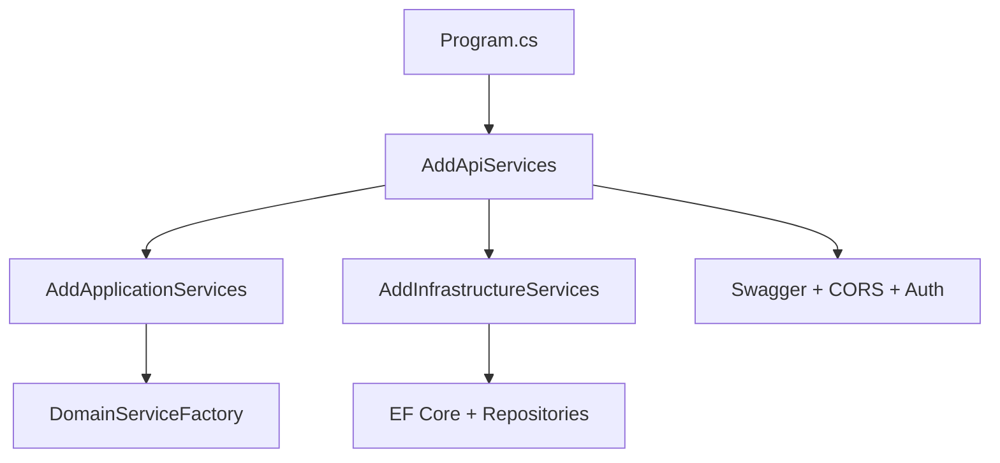

# Dependency Injection Architecture - DotNetSkills

Este documento describe la arquitectura de inyección de dependencias centralizada implementada en el proyecto DotNetSkills, siguiendo las mejores prácticas de Clean Architecture y .NET 9.

## 📋 Estructura General

Cada proyecto en la solución contiene dos archivos clave para la gestión de dependencias:

```
src/DotNetSkills.{Layer}/
├── DependencyInjection.cs    # Configuración centralizada de DI
└── GlobalUsings.cs           # Using statements globales por capa
```

## 🏗️ Arquitectura por Capas

### 1. **Domain Layer** (`DotNetSkills.Domain`)

**Responsabilidades:**
- NO debe depender de Microsoft.Extensions.DependencyInjection
- Proporciona factory methods para servicios de dominio
- Mantiene la pureza de la capa de dominio

**Archivos:**
- `DomainServiceFactory.cs` - Factory pattern para servicios de dominio
- `GlobalUsings.cs` - Referencias internas del dominio

```csharp
// Uso desde capas superiores
foreach (var (serviceType, implementationType) in DomainServiceFactory.GetDomainServices())
{
    services.AddTransient(serviceType, implementationType);
}
```

### 2. **Application Layer** (`DotNetSkills.Application`)

**Responsabilidades:**
- Registra servicios de aplicación (MediatR, AutoMapper, FluentValidation)
- Orquesta el registro de servicios de dominio
- Define contratos de infraestructura

**Archivos:**
- `DependencyInjection.cs` - Método `AddApplicationServices()`
- `GlobalUsings.cs` - Referencias de dominio y aplicación

```csharp
// Registro de servicios
builder.Services.AddApplicationServices();
```

### 3. **Infrastructure Layer** (`DotNetSkills.Infrastructure`)

**Responsabilidades:**
- Registra implementaciones de repositorios
- Configura Entity Framework Core
- Integra servicios externos

**Archivos:**
- `DependencyInjection.cs` - Método `AddInfrastructureServices(configuration)`
- `GlobalUsings.cs` - Referencias EF Core e implementaciones

```csharp
// Registro con configuración
builder.Services.AddInfrastructureServices(builder.Configuration);
```

### 4. **API Layer** (`DotNetSkills.API`)

**Responsabilidades:**
- Orquesta el registro de todas las capas
- Configura servicios específicos de API (Swagger, CORS, Auth)
- Define políticas de autorización

**Archivos:**
- `DependencyInjection.cs` - Método `AddApiServices(configuration)`
- `GlobalUsings.cs` - Referencias ASP.NET Core

```csharp
// Program.cs simplificado
builder.Services.AddApiServices(builder.Configuration);
```

## 🧪 Proyectos de Test

Cada proyecto de test tiene su propia configuración de DI para mocks y servicios de testing:

### Test Projects Structure
```
tests/DotNetSkills.{Layer}.UnitTests/
├── DependencyInjection.cs    # Servicios de testing y mocks
└── GlobalUsings.cs           # Referencias de testing (xUnit, FluentAssertions, Moq)
```

**Métodos disponibles:**
- `AddDomainTestServices()` - Builders y factories para domain tests
- `AddApplicationTestServices()` - Mocks de repositorios y MediatR setup
- `AddInfrastructureTestServices()` - In-memory database y servicios reales
- `AddApiTestServices()` - TestServer setup y authentication mocks

## 🔧 Flujo de Registro de Dependencias



### Orden de Ejecución:
1. **Domain** → Factory pattern (sin DI directo)
2. **Application** → Registra servicios de dominio + CQRS
3. **Infrastructure** → Implementa contratos de aplicación
4. **API** → Orquesta todo + servicios específicos de web

## 📦 Paquetes NuGet por Capa

### Domain
- ✅ Solo .NET 9 base (no dependencias externas)

### Application
- `Microsoft.Extensions.DependencyInjection.Abstractions`
- MediatR (pendiente)
- AutoMapper (pendiente)
- FluentValidation (pendiente)

### Infrastructure
- `Microsoft.Extensions.DependencyInjection.Abstractions`
- `Microsoft.Extensions.Configuration.Abstractions`
- Entity Framework Core (pendiente)

### API
- `Microsoft.AspNetCore.OpenApi`
- `Swashbuckle.AspNetCore`

### Tests
- `xunit`
- `FluentAssertions`
- `Moq`
- `Microsoft.AspNetCore.Mvc.Testing` (API tests)

## 🚀 Uso en el Código

### 1. Program.cs Simplificado
```csharp
using DotNetSkills.API;

var builder = WebApplication.CreateBuilder(args);

// Una sola línea registra todo el sistema
builder.Services.AddApiServices(builder.Configuration);

var app = builder.Build();

// Configuración del pipeline...
await app.RunAsync();
```

### 2. Agregando Nuevos Servicios

**Domain Services:**
```csharp
// En DomainServiceFactory.cs
yield return (typeof(IBusinessRuleValidator), typeof(BusinessRuleValidator));
```

**Application Services:**
```csharp
// En Application/DependencyInjection.cs
services.AddMediatR(cfg => cfg.RegisterServicesFromAssembly(assembly));
services.AddAutoMapper(assembly);
```

**Infrastructure Services:**
```csharp
// En Infrastructure/DependencyInjection.cs
services.AddDbContext<ApplicationDbContext>(options =>
    options.UseNpgsql(configuration.GetConnectionString("DefaultConnection")));
services.AddScoped<IUserRepository, EfUserRepository>();
```

## 🎯 Beneficios de esta Arquitectura

### ✅ **Centralización**
- Un solo lugar por capa para configurar dependencias
- Fácil mantenimiento y debugging

### ✅ **Separación de Responsabilidades**
- Cada capa registra solo sus servicios
- Respeta las reglas de Clean Architecture

### ✅ **Testabilidad**
- Configuraciones específicas para testing
- Mocks centralizados por capa

### ✅ **Escalabilidad**
- Fácil agregar nuevos servicios
- Patrón consistente en toda la solución

### ✅ **Performance**
- Global usings reducen verbosidad
- Registro eficiente de servicios

## 🔍 Próximos Pasos

1. **Implementar MediatR** en Application layer
2. **Configurar Entity Framework** en Infrastructure layer
3. **Agregar FluentValidation** para validación de input
4. **Implementar AutoMapper** para entity ↔ DTO mapping
5. **Configurar JWT Authentication** en API layer

## 📚 Referencias

- [Clean Architecture Principles](/.github/instructions/dotnet-arquitecture.instructions.md)
- [.NET Dependency Injection Best Practices](https://docs.microsoft.com/en-us/dotnet/core/extensions/dependency-injection-guidelines)
- [ASP.NET Core DI Guidelines](https://docs.microsoft.com/en-us/aspnet/core/fundamentals/dependency-injection)

---

**Mantener este patrón** al agregar nuevos servicios para asegurar consistencia y mantenibilidad en toda la solución.
