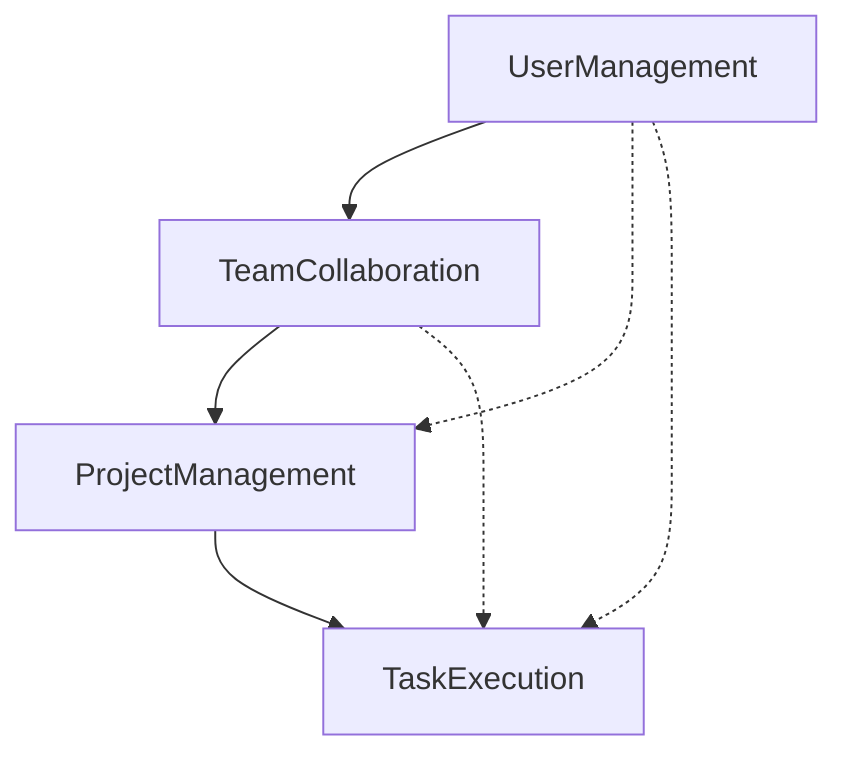
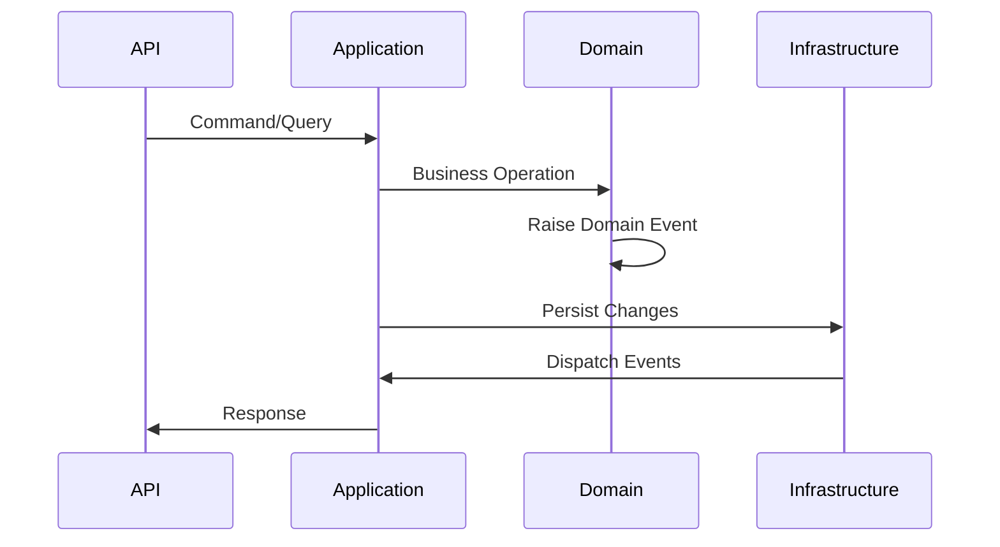

## DotNetSkills - Component Cross-Reference Guide

### Bounded Context Relationships

### Domain Entity Relationships

| Aggregate Root | Owns | References | Events Raised |
|----------------|------|------------|---------------|
| User | TeamMember (via Team) | - | UserCreated, UserDeactivated |
| Team | TeamMember | User | TeamCreated, UserJoinedTeam, UserLeftTeam |
| Project | - | Team | ProjectCreated, ProjectStatusChanged |
| Task | Subtasks | Project, User | TaskCreated, TaskAssigned, TaskStatusChanged |

### Application Service Dependencies

| Bounded Context | Depends On | Reason |
|-----------------|------------|--------|
| TeamCollaboration | UserManagement | User validation and retrieval |
| ProjectManagement | TeamCollaboration | Team membership validation |
| TaskExecution | ProjectManagement, UserManagement | Project context and user assignment |

### Interface Contracts

| Interface | Implementation | Location | Purpose |
|-----------|----------------|----------|---------|
| IUserRepository | EfUserRepository | Infrastructure | User data access |
| ITeamRepository | EfTeamRepository | Infrastructure | Team data access |
| IProjectRepository | EfProjectRepository | Infrastructure | Project data access |
| ITaskRepository | EfTaskRepository | Infrastructure | Task data access |

### Event Flow

